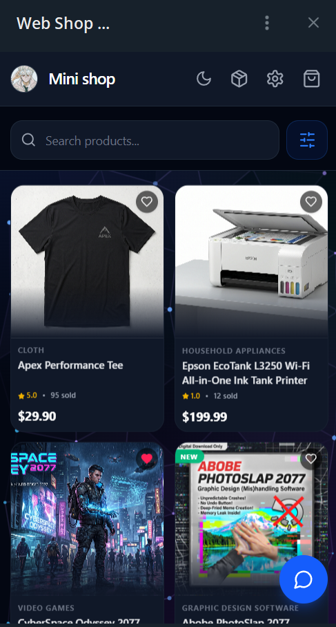
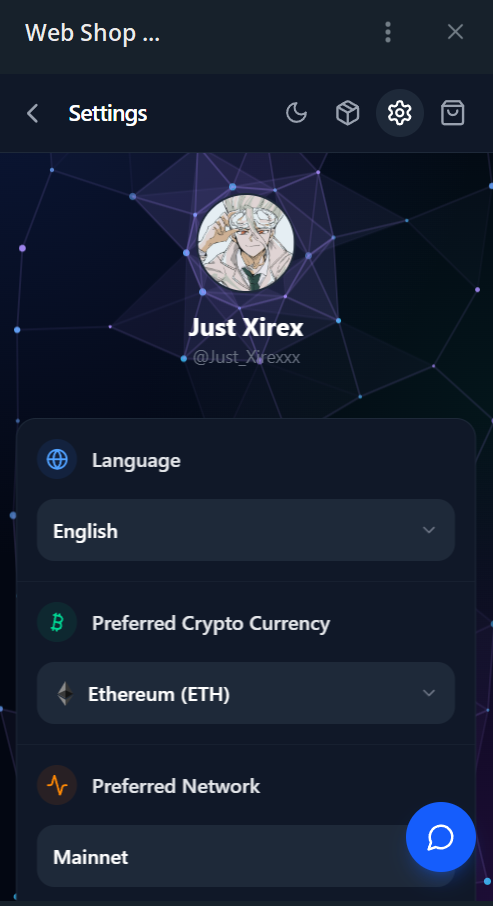
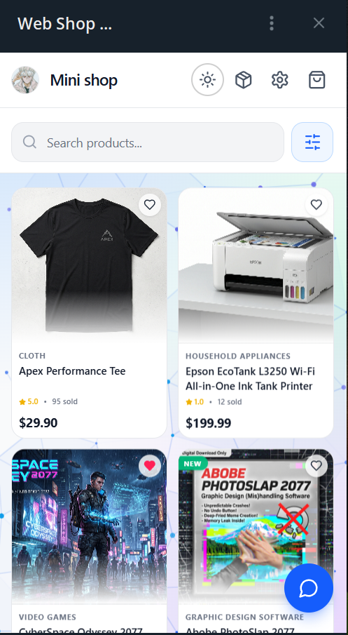
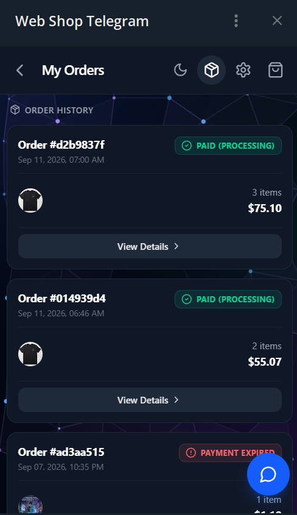
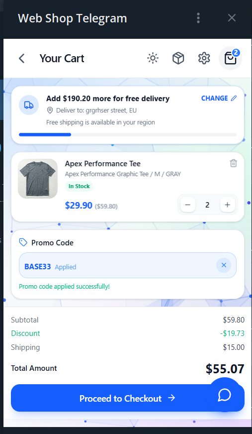
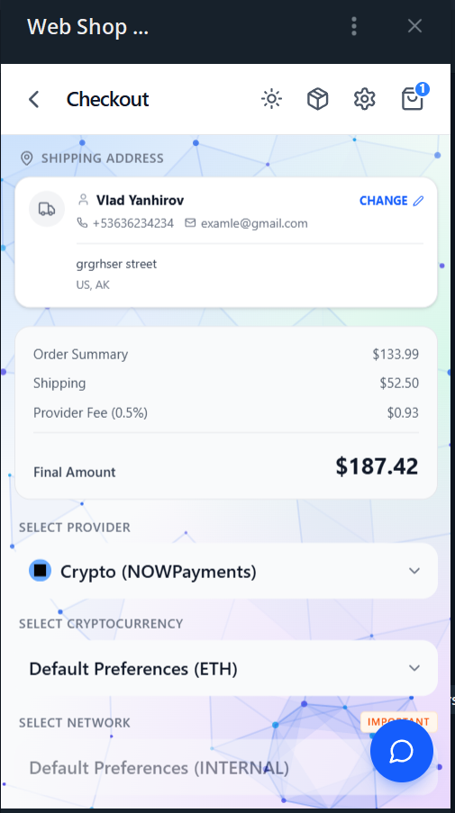
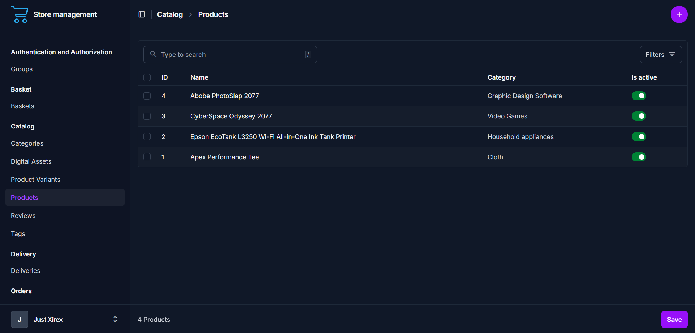

  

# Web Telegram Shop (TMA + Crypto Payments)

This project is a universal Telegram Mini App (TMA) shop with cryptocurrency payment integration. It is designed for small businesses looking to start selling directly in Telegram, or for developers who need a production-ready e-commerce backend to integrate into their own projects.

---

## See It In Action

  <video src="https://github.com/user-attachments/assets/54701dbb-bf5f-4f7e-b306-60e789be6ff9" width="600" controls></video>
   
  <i>* Note: The products shown in this video are fictional and generated by AI for demonstration purposes.</i>

### Screenshots

  
  
  
   
  
  
  
   
  <i>* Note: The products shown in these screenshots are fictional and generated by AI.</i>

### Admin Panel

  
   
  <i>* Note: The store administration is powered by a modern, responsive interface.</i>

---

## Features

- **Clean Architecture:** Business logic is decoupled from frameworks, strictly separated into Use Cases and Repositories.
- **Crypto Payments:** Out-of-the-box integration with **NOWPayments** and **CryptoBot**. The architecture allows easy addition of new payment gateways.
- **Telegram Mini App (TMA):** A React-based frontend that operates seamlessly inside Telegram as a Web App.
- **Modern Admin Panel:** Beautiful, Tailwind-based administration interface powered by `django-admin-unfold`.
- **Asynchronous Tasks:** Celery and Redis manage background operations like order expiration and payment status polling.
- **Localization:** Supports multiple languages. *Note: English is the primary language; other languages are machine-translated and may contain minor inaccuracies.*

---

## Under the Hood

The project is structured as a monorepo containing the Backend API, Telegram Bots, and Frontend TMA.

- **Backend:** Python 3.12, Django, Django REST Framework (DRF), PostgreSQL.
- **Architecture:** Clean Architecture, Domain-Driven Design concepts.
- **Workers & Cache:** Celery, Redis, Celery Beat.
- **Frontend:** TypeScript, React.
- **Infrastructure:** Docker, Docker Compose, GitHub Actions (CI/CD).

---

## How to Run It

To keep this documentation clean, all deployment configurations, environment setup, and Docker instructions have been moved to separate files.

👉 **[Read the Setup Guide (docs/SETUP.md)](docs/SETUP.md)** to get the project running locally or deploy it to production.

👉 **[Read the Configuration Guide (docs/CONFIG.md)](docs/CONFIG.md)** to learn how to manage business rules, delivery zones, payment gateways, and translations without code changes.

👉 **[Read the Commands Reference (docs/COMMANDS.md)](docs/COMMANDS.md)** for a complete list of Makefile commands used for building, testing, and running quality assurance checks.

---

## Support & Feedback

<h2 align="center">
  If you find this project or its architecture useful, I’d massively appreciate a ⭐️ Star on this repository!
</h2>

 

**Got ideas or found a bug?**

- 🐛 Open an **Issue** right here on GitHub.
- 💬 Hit me up on Telegram: [@Just_Xirexxx](https://t.me/Just_Xirexxx)
- 📧 Drop me an email: [xyroset+dev@gmail.com](mailto:xyroset+dev@gmail.com)

---

## License

This project is open-source and available under the [MIT License](LICENSE).
